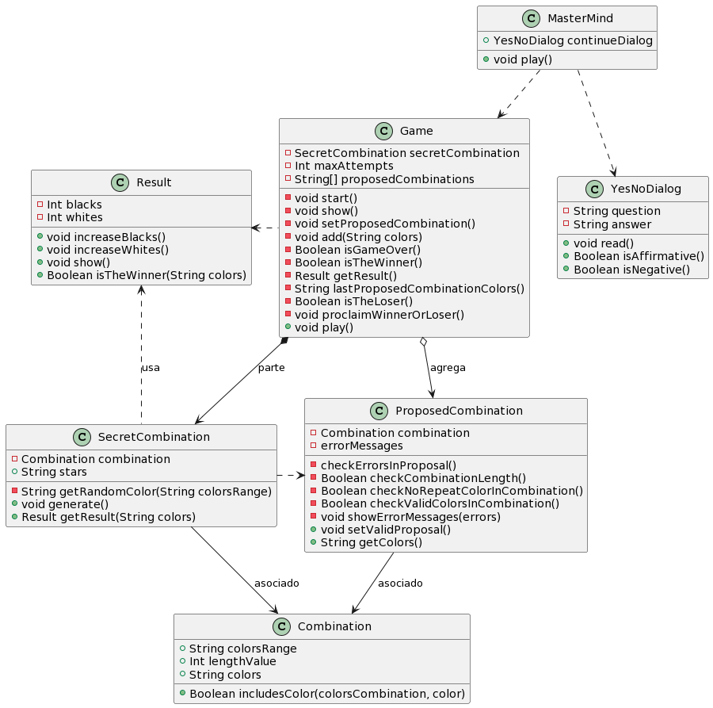

# game-mastermind v0.2.1

* [Diagrama de Clases](#classDiagram)
* [plantUML](#plantUML)

## Diagrama de Clases



## plantUML

```
@startuml

class Game {
  -Int maxAttempts
  -SecretCombination secretCombination
  -ProposedCombination proposedCombination
  -Result result
  -void start()
  -Boolean isGameOver()
  -Boolean isTheLoser()
  -Boolean continues()
  -void proclaimWinnerOrLoser()
  +void play()
}

class YesNoDialog {
  +String question
  +String answer
  +void read()
  +Boolean isAffirmative()
  +Boolean isNegative()
}

class SecretCombination {
  -Combination combination
  +String theSecret
  +String stars
  +Boolean isTheWinner
  -String getRandomColor(String colors)
  -void updateAttempts(proposedCombination, Int blackTokens, Int whiteTokens)
  +void generate()
  +void rateProposal(proposedCombination, result)
}

class ProposedCombination {
  -Combination combination
  -errorMessages
  +String theProposal
  +Int totalAttempts
  +String attempts
  -checkErrorsInProposal(String theProposal)
  -Boolean checkCombinationLength(String theProposal)
  -Boolean checkNoRepeatColorInCombination(String theProposal)
  -Boolean checkValidColorsInCombination(String theProposal)
  -void showErrorMessages(errors)
  +void setValidProposal()
  +void increaseAttempts()
}

class Combination {
  +String colors
  +Int theLength
  +Boolean includesColor(colorsCombination, color)
}

class Result {
  +void show(proposedCombination, secretCombination)
  +calculate(secretCombination, proposedCombination, combination)
}

Game .right.> YesNoDialog
Game *-down-> SecretCombination
Game *-down-> ProposedCombination
Game *-left-> Result
SecretCombination -left-> Result
SecretCombination -right-> ProposedCombination
SecretCombination -down-> Combination
ProposedCombination -down-> Combination

@enduml
```
